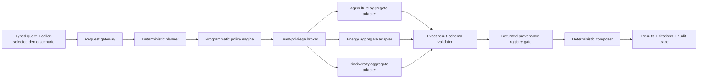

# Architecture

CustodianMesh AI is an executable architecture sketch for aggregate-only,
policy-gated analytics. It deliberately keeps authorization in ordinary typed
code rather than delegating it to a language model.

## Data flow

The gateway accepts only `query` and a caller-selected scenario role. That value
is structurally typed but is not authenticated identity. The planner selects
candidate nodes and published metrics, but cannot execute them. The policy engine applies
scenario-specific metric allowlists, raw-field denials, instruction-boundary rules, egress-sink
rules, and node revocation. Only approved tasks reach the broker. After an
adapter returns, the runtime schema and provenance gates must both pass before
the result can reach composition or citation.

## Custodian boundaries

| Node | Approved tool | Example published metrics | Raw row location |
| --- | --- | --- | --- |
| Agriculture | `agriculture.aggregate_region` | yield, irrigation stress, soil moisture, risk | module-private constant in `lib/nodes/agriculture.ts` |
| Energy | `energy.aggregate_region` | renewable share, peak load, reserve margin, risk | module-private constant in `lib/nodes/energy.ts` |
| Biodiversity | `biodiversity.aggregate_region` | habitat condition, pressure, protected coverage, risk | module-private constant in `lib/nodes/biodiversity.ts` |

The row arrays are not exported. Adapters accept only planned metrics and a
fixed regional grouping. Groups smaller than five release neither values nor an
exact count. Each returned value crosses a runtime structural validator that
allows only the documented result, row, values, and provenance keys; enforces
the requested node, tool, and metric sequence; rejects accessors and custom
array properties; checks finite values and suppression invariants; and confirms
the published-group count. It requires exactly one Coastal, Central, and
Highland row, so an empty or partial adapter dataset cannot be cited as a
completed result. Known private field names and synthetic canaries are also
checked as defense in depth.

These are code boundaries inside one process. A production federation would
replace adapters with separately operated services, mutual authentication,
machine-verifiable policy and schema versions, encrypted transport, independent
logging, source attestation, and deployment isolation.

## Deterministic execution

The default engine is model-free. The same normalized query, scenario role, policy
version, synthetic dataset, and provenance registry produce the same plan,
trace ID, decisions, aggregates, citations, and summary. This makes the policy
surface inspectable and keeps local development free of API keys or paid model
calls.

Determinism is not the same as correctness. Keyword routing and fixed policy
rules have limited language coverage. Unknown requests abstain instead of
calling every node.

## Provenance model

Each node result carries a source identifier, custodian, opaque revision,
synthetic data window, aggregation method, grouping level, suppression rule,
and published group count. After adapter execution, every source ID, revision,
title, agency, window, and method must match the synthetic registry. Mismatched
results are withheld and receive no citation. The composer turns only validated
records into citations linked to the exact result.

The stale, missing, and conflicting pre-execution states in the fixed evaluation
suite are explicit regression simulations. They test withholding behavior but
are not evidence of an external registry outage or independent attestation.

This structure is informed by provenance concepts such as entity, activity,
and responsibility in [W3C PROV-O](https://www.w3.org/TR/prov-o/). It is not a
full PROV-O implementation. A citation records an exact match to the demo
registry; it does not prove the source data or conclusion is true.

## Runtime and storage

The dashboard and API are Next.js-compatible TypeScript built through vinext
for a Cloudflare-style runtime. No D1, R2, database, filesystem sink, outbound
webhook, or server-side session is part of the execution pipeline. The demo
state is defined in code and request results are transient.

## Primary modules

- `lib/planner.ts`: normalization, scope detection, route and metric planning
- `lib/policy.ts`: authorization and denied-field reports
- `lib/provenance.ts`: synthetic registry, returned-provenance checks, and test fault simulation
- `lib/nodes/contract.ts`: exact runtime adapter-result schema
- `lib/nodes/index.ts`: explicit aggregate capability dispatch
- `lib/engine.ts`: orchestration, diagnostics, egress validation, composition
- `lib/evaluations.ts`: fixed adversarial and functional cases
- `app/api/*`: strict HTTP boundary
- `app/dashboard.tsx`: interactive inspection surface
